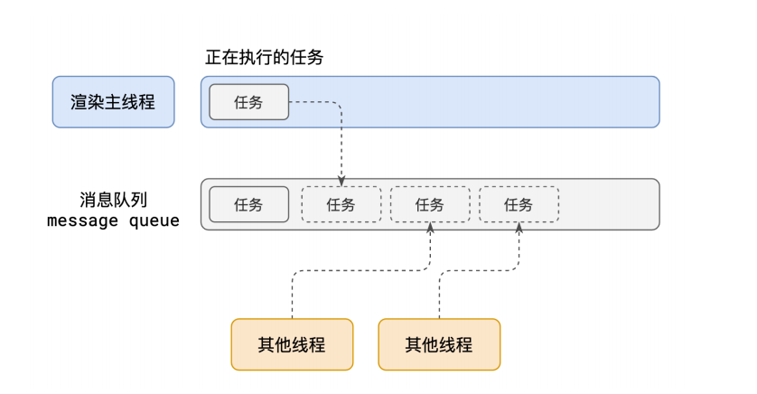
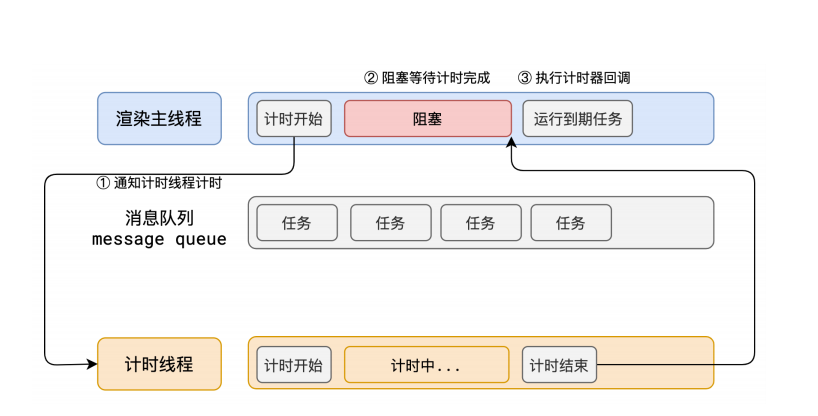
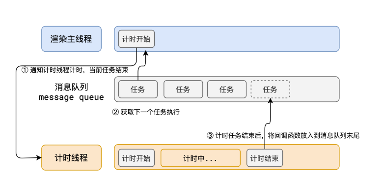

## 浏览器进程模型

### 何为进程

程序运行需要有它自己专属的内存空间，可以把这块内存空间简单理解为进程。

每个应用至少有一个进程，进程指甲相互独立，如果要通信，需要双方同意。

### 何为线程

线程是进程的执行单元，负责执行进程中的代码。

一个进程至少有一个线程，所以在进程开启后自动创建一个线程来运行代码，该线程称为主线程。

如果程序需要同时执行多块代码，主线程就会启动更多的线程来执行代码，所以一个进程可以包含多个线程。

## 浏览器有哪些进程和线程

浏览器是一个多进程多线程的应用程序

其中最主要的进程有：

1. 浏览器进程
   主要负责页面显示、用户交互、子进程管理等。浏览器进程内部会启动多个线程处理不同的任务。
2. 网络进程
   负责加载网络资源。网络进程内部会启动多个线程来处理不同的网络任务。
3. 渲染进程
   渲染进程启动后，会开启一个渲染主线程，主线程负责执行 HTML CSS JS 代码。
   默认情况下，浏览器会为每个标签页开启一个新的渲染进程，以保证不同的标签页之间不互相影响。

## 渲染主线程是如何工作的

渲染主线程需要处理的任务包括但不限于：

- 解析 HTML
- 解析 CSS
- 计算样式
- 布局
- 处理图层
- 执行 js 代码
- 执行事件处理函数
- ....

之所以只有一个主线程，是因为多线程同时操作 DOM 会导致页面渲染出问题。

比如，两个线程同时修改同一个 DOM 节点，浏览器无法确定以哪个线程为准，从而导致渲染结果不一致。

所以 渲染主线程使用排队来解决任务执行的问题，这就是事件循环。

## 事件循环



1. 最开始时，渲染主线程会进入一个无限循环。
2. 每一次循环会检查消息队列中是否有任务存在，如果有，就取出第一个任务执行，执行完一个进入下一个循环；如果没有就进入休眠状态。
3. 其他所有线程（包括其他进程的线程）可以随时想消息队列添加任务。新任务会加到消息队列的末尾。在添加新任务时，如果主线程是休眠状态，则会将其唤醒以继续拿取任务。

如此反复，整个过程，被称为事件循环（消息循环）

## 何为异步？

代码在执行过程中，会遇到一下无法立即处理的任务，比如：

- 计时完成后需要执行的任务 -- setTimeout、setInterval
- 网络通信完成后需要执行的任务 -- XHR、Fetch
- 用户操作后需要执行的任务 -- addEventListener

如果让渲染主线程等待这些任务的时机达到，就会导致主线程长期处于阻塞的状态，导致浏览器卡死。



所以面对这些任务，浏览器会交给其他线程处理，处理完成后，再添加到消息队列中，等待主线程执行。



::: tip 如何理解 JS 的异步
参考答案
JS 是一门单线程的语言，这是因为它运行在浏览器的渲染主线程中，而渲染主线程只有一个。
而渲染主线程承担着渲染页面、执行 js 等任务。如果这些任务采用同步的方式执行，
就会导致主线程长时间处于阻塞状态，从而导致浏览器卡死。
所以浏览器采用异步的方式来避免，具体做法是当某些任务发生时，如计时器、网络、事件监听等，
主线程会将任务交给其他线程处理，自身继续执行后续代码。

    当其他线程处理任务完成后，将回调函数添加到消息队列中，等待主线程的执行。

    在这种模式下，浏览器用不阻塞，从而最大限度保证但线程的流畅运行。

:::

## js 为何会阻碍渲染

```html
<h1>Mr.Yuan is awesome!</h1>
<button>change</button>
<script>
  var h1 = document.querySelector("h1");
  var btn = document.querySelector("button");
  // 死循环指定的时间
  function delay(duration) {
    var start = Date.now();
    while (Date.now() - start < duration) {}
  }
  btn.onclick = function () {
    h1.textContent = "打印一下";
    delay(3000);
  };
</script>
```

### 任务有优先级吗

任务没有优先级，在消息队列中先进先出

但是 **消息队列有优先级**

根据W3C标准
- 每个任务都有一个任务类型，同一个类型的任务必须在一个队列，不同的任务可以分属于不同的队列。
在一次时间循环中，浏览器可以根据实际情况从不同的队列中取出任物执行。

- 浏览器必须准备好一个微队列，微队列中的任务优先所有其他任务执行

[微任务](https://html.spec.whatwg.org/multipage/webappapis.html#perform-a-microtask-checkpoint)


在目前 chrome 的实现中，至少包含了下面的队列

- 延时队列：用于存放计时器到达后的回调任务，优先级[中]
- 交互队列：用于存放用户操作后产生的时间处理任务，优先级[高]
- 微队列：用于存放需要最快执行的任务，优先级[最高]

::: tip 添加任务到微队列的主要方式主要是使用 Promise、MutationObserver等。

例如：
```js
//
Promise.resolve().then(函数)
```
:::

::: tip 面试题 阐述一下JS的事件循环

事件循环又叫消息循环，是浏览器渲染主线程的工作方式。
在Chrome的源码中，它开启了一个不会结束的for循环，每次循环从消息队列中取出第一个任务执行，而其他线程只需要在合适的时候将任务加入到队列末尾即可。

过去把消息队列简单分为宏队列和微队列，这种说法目前已无法满足复杂的浏览器环境，取而代之的是一种更加灵活多变的处理方式。
根据W3C官方的解释，每个任务有不同的类型，同类型的任务必须在同一个队列，不同任务可以属于不同的队列。不同任务队列有不同的优先级，在一次事件循环中，由浏览器自行决定取哪一个队列的任务，但是浏览器必须有一个微队列，微队列的任务一定具有最高的优先级，必须优先调度执行。
:::


::: tip JS中的计时器能做到精确计时吗？为什么？

参考答案：

不能，因为

1. 计算机硬件没有原子钟，无法做到精确计时。
2. 操作系统的计时函数本身就有少量偏差，由于JS的计时器最终调用的是操作系统的函数，也就携带了这些偏差
3. 根据W3C标准，浏览器实现计时器时，如果嵌套层级超过5层，则会有4毫秒的最少时间，这样在计时时间少于4毫秒时又带来了偏差。
4. 受事件循环的影响，计时器的回调函数只能在主线程空闲时运行，因此又带来了偏差
:::