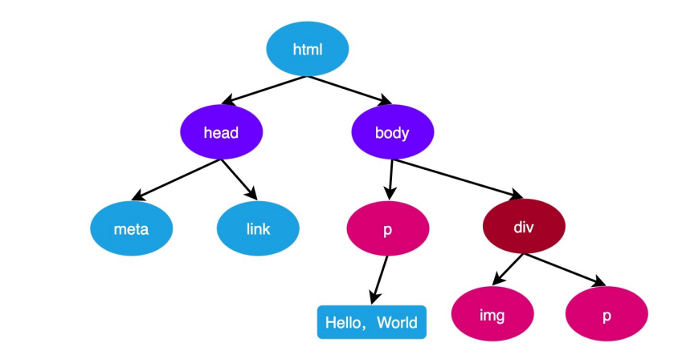
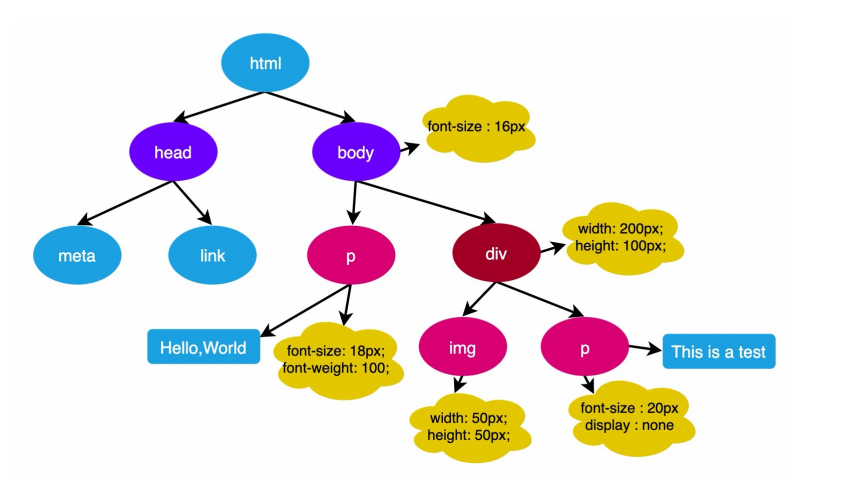

### 解析 HTML

浏览器从网络或本地文件中获取到 HTML 源代码，然后从上到下的解析源代码

若解析过程中，读取到 CSS 或 JS，停止解析（阻塞），转而解析 CSS 或执行 JS

```html
<!DOCTYPE html>
<html lang="en">
  <head>
    <meta charset="UTF-8" />
    <meta http-equiv="X-UA-Compatible" content="IE=edge" />
    <meta name="viewport" content="width=device-width, initial-scale=1.0" />
    <title>Document</title>
    <link rel="stylesheet" href="./css/index.css" />
  </head>
  <body>
    <h1>Hello World!</h1>
    <script src="./js/index.js"></script>
    <p>Lorem</p>
  </body>
</html>
```

读取HTML -> 解析HTML -> 读取css -> 解析css -> 解析HTML -> 读取JS -> 执行JS -> 解析HTML

> 为什么要将css写到页面的开头，而js写到页面的最后
> css写在开头是为了让浏览器尽快读取并解析样式，避免给用户看到样式未加载的情况，也是为了避免页面闪烁
> 将js代码写到最后，是为了让浏览器尽快呈现页面给用户，然后在执行JS完成交互功能

### 生成 DOM 树

浏览器会一边解析HTML，一边生成DOM树。



当DOM树完全生成好后，会触发DOMContentLoaded事件

```js
document.addEventListener('DOMContentLoaded', () => {
  console.log('DOMContentLoaded')
})
```

当页面中所有外部资源全部加载完毕后，会出发`load`事件
```js
window.onload = function(){
  console.log('所有资源已加载完成')
}
```

### 生成 渲染树

浏览器一边生成DOM树，一边计算DOM树中每个节点的样式规则，最终形成渲染树。

CSS属性的计算过程，发生在这一个步骤



### 布局 Layout / 重排 reflow

这个步骤又称为 **reflow(回流，重排)**，是指浏览器一边生成渲染树，一边计算每个元素最终的尺寸和位置。

完成后，页面中所有元素的位置和尺寸就确定下来了，即将被渲染到页面。

这个步骤会在页面之后的运行过程中不断的重复，**下面的操作均会导致reflow**

- 获取元素的尺寸和位置
- 直接或间接改变元素的尺寸和位置

> reflow非常耗时，浏览器为了提升性能，对js中连续导致reflow的代码，把reflow的时间点延迟到结束后进行，但在此过程中，**如果遇到了获取尺寸和位置的代码，浏览器会迫不得已立即reflow**

```js
dom.style.width = '100px'
dom.style.height = '100px'
dom.style.left = '10px'
dom.style.top = '10px'
```

改变宽度 -> 改变高度 -> 改变横坐标 -> 改变纵坐标 -> reflow

```js
dom.style.width = '100px'
dom.style.height = '200px'
dom.clientHeight;
dom.style.left = '10px'
dom.style.top = '10px'
```

改变宽度 -> 改变高度 -> 读取高度-> reflow-> 改变横坐标 -> 改变纵坐标 -> reflow


### 重绘

浏览器一边reflow，一边进行生成对应的图形绘制到页面，绘制的过程称为repaint

所有会导致**reflow**的代码，均会导致**repaint**

绘制的过程是靠GPU来完成的，因此，**相对于导致reflow的代码，仅会导致repaint的代码效率会高出很多**

凡是不会影响盒子排列，仅影响盒子外观的代码都不会导致reflow，仅会导致repaint，例如：

- 改变背景颜色
- 改变字体颜色
- 圆角边框
- 背景图
。。。。