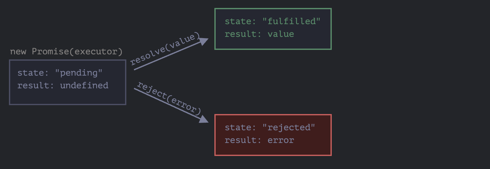

# Promise

## 基本格式

```js
const promise = new Promise((resolve,reject)=>{
    // 生产代码
})
```
传递给new Promise的函数称为executor，当new Promise被创建时，executor立即执行。
它的参数`resolve`和`reject`是由javascript自身提供的回调。我们的代码仅在executor内部。

- resolve(value): 任务成功完成时并带有结果value。
- reject(error): 任务如果失败返回error。

所以总结就是：executor函数会在Promise创建时尝试执行其中的任务，如果成功调用resolve，失败则调用reject。

由 new Promise构造器返回的promise对象具有以下属性：
- state：pending、fulfilled、rejected。
- result：undefined、value、error。




```js
let promise = new Promise(function (resolve, reject) {
        // 当 promise 被构造完成时，自动执行此函数
        // 1 秒后发出工作已经被完成的信号，并带有结果 "done"
        setTimeout(() => resolve("done"), 1000);
      })
```

执行结果：
1. executor函数立即执行，promise状态变为pending
2. 1秒后，executor函数调用resolve，promise状态变为fulfilled，result为"done"

```js
let promise = new Promise(function (resolve, reject) {
        // 当 promise 被构造完成时，自动执行此函数
        // 1 秒后发出工作已经被完成的信号，并带有结果 "done"
        setTimeout(() => reject(new Error("Whoops")), 1000);
      })
```

执行结果：
1. executor函数立即执行，promise状态变为pending
2. 1秒后，executor函数调用reject，promise状态变为rejected，result为new Error("Whoops")

**⚠️ executor只能调用一个resolve或者reject，多次调用除第一次以后的无效**

```js
let promise = new Promise(function (resolve, reject) {
        resolve("done");
        reject(new Error("…")); // 无效
      });
```

## then、catch

### then

语法：
```js
let promise = new Promise(function (resolve, reject) {
        setTimeout(() => resolve("done"), 1000);
      }).then((result)=>{
        //打印结果
        console.log(result);
      },(error)=>{
        //不运行
        console.log(error);
      })
```

then方法接受两个参数：onFulfilled和onRejected。它们都是可选的，并且都是函数。

- onFulfilled：当promise变为fulfilled状态时调用，接收promise的结果result作为参数。
- onRejected：当promise变为rejected状态时调用，接收promise的错误error作为参数。

如果我们只对成功感兴趣，可以只传入一个回调函数。

### catch

语法：

```js
let promise = new Promise(function (resolve, reject) {
        setTimeout(() => reject(new Error('whoops')), 1000);
      }).then((result)=>{
        //不运行
        console.log(result);
      },(error)=>{
        //打印错误信息
        console.log(error);
      })
```

### 清理 finally

finally方法在promise结束时，无论结果是fulfilled还是rejected，都会执行指定的回调函数。
finally方法不接受任何参数，它不接受promise的结果result或者错误error。

```js
let promise = new Promise(function (resolve, reject) {
        setTimeout(() => resolve("done"), 1000);
      }).then((result)=>{
        //打印结果
        console.log(result);
      },(error)=>{
        //不运行
        console.log(error);
      }).finally(()=>{
        //无论promise状态如何，都会执行
        console.log("finally");
      })
```

特点：

- finally方法不接受任何参数。同时他返回的内容会被忽略。
- finally如果发生错误会被它之后最近的错误处理程序接收。


### 示例 loadScript

```js
function loadScript(src, callback) {
  let script = document.createElement('script');
  script.src = src;

  script.onload = () => callback(null, script);
  script.onerror = () => callback(new Error(`Script load error for ${src}`));

  document.head.append(script);
}
```

重写版：

```js
function loadScript(src) {
  return new Promise(function(resolve, reject) {
    let script = document.createElement('script');
    script.src = src;

    script.onload = () => resolve(script);
    script.onerror = () => reject(new Error(`Script load error for ${src}`));

    document.head.append(script);
  });
}

```

使用：

```js
let promise = loadScript("https://cdnjs.cloudflare.com/ajax/libs/lodash.js/4.17.11/lodash.js");

promise.then(
  script => alert(`${script.src} is loaded!`),
  error => alert(`Error: ${error.message}`)
);

promise.then(script => alert('Another handler...'));
```