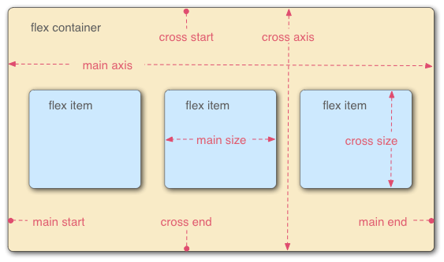
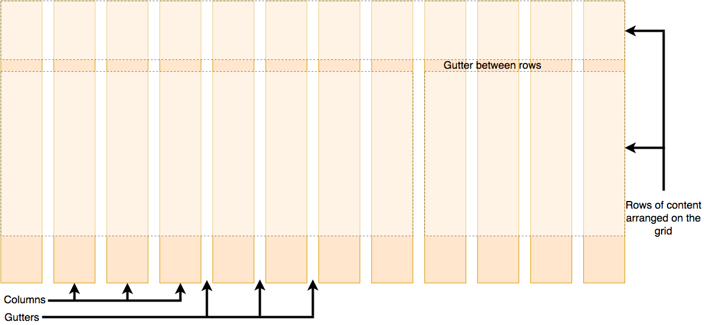

# CSS 布局

#### 布局方式

- 正常布局流
- display 属性
- 弹性盒子
- 网格
- 浮动
- 定位
- CSS 表格布局
- 多列布局

#### 正常布局流

- 块级元素
- 行内元素

覆盖默认的布局行为

- display
- 浮动
- position
- 表格布局
- 多列布局

#### display 属性

- block
- inline
- inline-block
- flex
- ...

#### 弹性盒子

设置`display:flex`

模型说明



- 主轴：水平方向
- 交叉轴：垂直方向
- 设置`display:flex`的元素为容器，其直接子元素为 flex 项

属性：

- flex-direction：设置主轴方向

  - row：水平方向，从左到右
  - row-reverse：水平方向，从右到左
  - column：垂直方向，从上到下
  - column-reverse：垂直方向，从下到上

- flex-wrap：设置是否换行
- flex-flow：flex-direction 和 flex-wrap 的简写
  - flex-flow:row wrap;
- flex: 设置 flex 项的伸缩比例
  - flex 是一个可以指定最多三个不同值的缩写属性
  - flex-grow:占比
  - flex-shrink: 缩小比例
  - flex-basis:最小宽度
- justify-content:设置主轴的对齐方式。
- align-items:设置交叉轴的对齐方式。
- align-self:设置单个子元素的交叉轴的对齐方式。
- order:设置子元素的排序顺序 值越小排名越靠前，最小值为-1

#### Grid 布局

设置`display:grid`



一个网格通常具有许多的列（column）与行（row），以及行与行、列与列之间的间隙，这些间隙一般被称为沟槽（gutter）

```css
.container {
  display: grid;
  grid-template-columns: 1fr 1fr 1fr;
  /* grid-template-rows: 1fr 1fr 1fr; */
}
```

- grid-template-columns：定义网格的列数以及每列的宽度
- grid-template-rows：定义网格的行数以及每行的高度
- grid-column-gap：定义网格列与列之间的间隙
- grid-row-gap：定义网格行与行之间的间隙（使用 grid-gap 可以同时设置 grid-column-gap 和 grid-row-gap，注意单位不能是 fr）
- grid-gap(gap)：定义网格行与行之间的间隙（使用 grid-gap 可以同时设置 grid-column-gap 和 grid-row-gap，注意单位不能是 fr）
- grid-template-columns: repeat(3, 1fr); 重复 3 次，每次 1fr
- grid-auto-rows: minmax(100px, auto); 定义行高最小 100px，最大为 auto。也可以是一个固定值 100px

fr 单位分配的是可用空间而非所有空间，所以如果某一个包含的内容变多了，那么整个可用空间就会减少，可用空间是不包含哪些已经确定被占用的空间的。

##### 自动使用多列填充

```css
.container {
  display: grid;
  grid-template-columns: repeat(auto-fill, minmax(200px, 1fr));
  grid-auto-rows: minmax(100px, auto);
  grid-gap: 20px;
}
/*形成一个最少宽度200px的网格，网格会自动根据容器宽度进行调整，每一列的宽度总是大雨200px*/
```

##### 基于线的元素放置

- grid-column-start：定义网格项的起始列
- grid-column-end：定义网格项的结束列
- grid-row-start：定义网格项的起始行
- grid-row-end：定义网格项的结束行

简写：

- grid-column：grid-column-start 和 grid-column-end 的简写
- grid-row：grid-row-start 和 grid-row-end 的简写

注意：开始与结束的线的序号要使用`/`符号分开。

##### 使用 grid-template-areas 属性放置元素

```css
.container {
  display: grid;
  grid-template-areas:
    "header header"
    "sidebar content"
    "footer footer";
  grid-template-columns: 1fr 3fr;
  gap: 20px;
}

header {
  grid-area: header;
}

article {
  grid-area: content;
}

aside {
  grid-area: sidebar;
}

footer {
  grid-area: footer;
}
```

使用规则：

1. 需要填满网格的每个格子。
2. 对于某个横跨多个格子的元素，重复写上那个元素`grid-area`属性定义的区域名字。
3. 所有名字只能出现在一个连续的区域，不能在不同的位置出现。
4. 一个连续的区域必须是一个矩形。
5. 使用`.`符号，让一个格子留空。

CSS网格实现的网格排版框架

推荐阅读
- [CSS网格指南](https://developer.mozilla.org/zh-CN/docs/Web/CSS/CSS_grid_layout#guides)
- [CSS 网格检查器](https://firefox-source-docs.mozilla.org/devtools-user/page_inspector/how_to/examine_grid_layouts/index.html)


#### 浮动

float 属性

- left：元素向左浮动
- right：元素向右浮动
- none：元素不浮动
- inherit：元素继承父元素的浮动属性

应用：
文字环绕图片

清除浮动：
- clear 属性
  - left：不允许左侧有浮动元素
  - right：不允许右侧有浮动元素
  - both：不允许左右两侧有浮动元素
  - none：允许两侧有浮动元素
  - inherit：元素继承父元素的清除浮动属性
- display:flow-root; 清除浮动

#### 定位

设置 position 属性

- static：默认值，元素按照正常布局流进行排列
- relative：元素相对于其正常位置进行定位
- absolute：元素相对于最近的已定位祖先元素进行定位
- fixed：元素相对于浏览器窗口进行定位
- sticky：元素在跨越特定阈值前为相对定位，之后为固定定位

层级

- z-index：设置定位元素的层级

#### 表格布局

设置`display:table`

- dispaly:table-row
- display:table-cell
- display:table-caption
  - caption-side:bottom|top

```html
<form>
  <p>First of all, tell us your name and age.</p>
  <div>
    <label for="fname">First name:</label>
    <input type="text" id="fname" />
  </div>
  <div>
    <label for="lname">Last name:</label>
    <input type="text" id="lname" />
  </div>
  <div>
    <label for="age">Age:</label>
    <input type="text" id="age" />
  </div>
</form>
```

```css
html {
  font-family: sans-serif;
}

form {
  display: table;
  margin: 0 auto;
}

form div {
  display: table-row;
}

form label,
form input {
  display: table-cell;
  margin-bottom: 10px;
}

form label {
  width: 200px;
  padding-right: 5%;
  text-align: right;
}

form input {
  width: 300px;
}

form p {
  display: table-caption;
  caption-side: bottom;
  width: 300px;
  color: #999;
  font-style: italic;
}
```

#### 多列布局

属性：

- column-count：指定列数
- column-width：指定列宽
- column-gap：指定列间距
- column-rule：指定列边框
- column-span：指定列跨度
- column-fill：指定列填充方式
- column-break-before：指定列前换行
- column-break-after：指定列后换行
- column-break-inside：指定列内换行

```html
<div class="container">
  <h1>Multi-column layout</h1>

  <p>Paragraph 1.</p>
  <p>Paragraph 2.</p>
</div>
```
