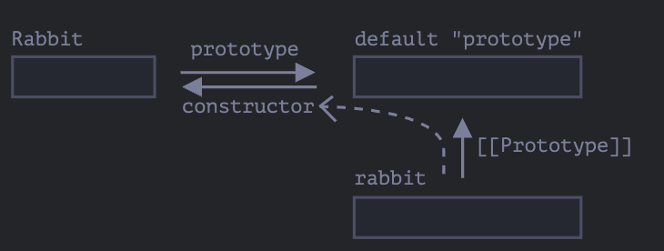

# 原型、继承

## `[[Prototype]]`

在 JavaScript 中，对象有一个特殊的隐藏属性`[[Prototype]]`，它要么是`null`，要么是对另一个对象的引用。该对象被称为原型。


当我们从一个`object`中读取一个缺失的属性时，javascript 会自动从原型中获取该属性。这种方式被称为“原型继承”。

读取或设置原型：`__proto__`

```js
let animal = {
  eats: true,
};
let rabbit = {
  jumps: true,
};

rabbit.__proto__ = animal;
```

当自身对象没有访问的某个属性时，会访问原型对象上的属性。

```js
let animal = {
  eats: true,
};
let rabbit = {
  jumps: true,
};

rabbit.__proto__ = animal; // (*)

// 现在这两个属性我们都能在 rabbit 中找到：
alert(rabbit.eats); // true (**)
alert(rabbit.jumps); // true
```


对象会自动继承原型链上的方法和属性。

```js
let animal = {
  eats: true,
  walk() {
    alert("Animal walk");
  },
};

let rabbit = {
  jumps: true,
  __proto__: animal,
};

// walk 方法是从原型中获得的
rabbit.walk(); // Animal walk
```

多个原型的继承被称为原型链，它们有两个限制：

- 不能形成闭环
- `__proto__`的值可以是对象，也可以是`null`。其他类型会被忽略

::: tip `__proto__`属性是`[[Prototype]]`因历史原因留下的 getter/setter。

在现代模式下，建议使用`Object.getPrototypeOf`和`Object.setPrototypeOf`来获取和设置`[[Prototype]]`。
:::

#### 写入不使用原型

原型仅用于读取属性。

对于写入/删除操作可以直接在对象上进行。

```js
let animal = {
  eats: true,
  walk() {
    /* rabbit 不会使用此方法 */
  },
};

let rabbit = {
  __proto__: animal,
};

rabbit.walk = function () {
  alert("Rabbit! Bounce-bounce!");
};

rabbit.walk(); // Rabbit! Bounce-bounce!
```

在访问器上有一个例外，

```js
let user = {
  name: "John",
  surname: "Smith",

  set fullName(value) {
    [this.name, this.surname] = value.split(" ");
  },

  get fullName() {
    return `${this.name} ${this.surname}`;
  },
};

let admin = {
  __proto__: user,
  isAdmin: true,
};

alert(admin.fullName); // John Smith (*)

// setter triggers!
admin.fullName = "Alice Cooper"; // (**)

alert(admin.fullName); // Alice Cooper，admin 的内容被修改了
alert(user.fullName); // John Smith，user 的内容被保护了
```

#### this 的值

`this`的值取决于函数如何被调用。不受原型的影响。

#### for...in 循环

`for...in`循环会迭代继承的属性。但是只可以迭代可以被枚举的属性。

```js
let animal = {
  eats: true,
};

let rabbit = {
  jumps: true,
  __proto__: animal,
};

// Object.keys 只返回自己的 key
alert(Object.keys(rabbit)); // jumps

// for..in 会遍历自己以及继承的键
for (let prop in rabbit) alert(prop); // jumps，然后是 eats
```

如果想排出继承的属性可以使用` obj.hasOwnProperty(key)`

```js
let animal = {
  eats: true,
};

let rabbit = {
  jumps: true,
  __proto__: animal,
};

for (let prop in rabbit) {
  let isOwn = rabbit.hasOwnProperty(prop);

  if (isOwn) {
    alert(`Our: ${prop}`); // Our: jumps
  } else {
    alert(`Inherited: ${prop}`); // Inherited: eats
  }
}
```

#### 为什么`Object.hasOwnProperty`没有出现在循环中。

因为`Object.hasOwnProperty`的枚举属性被设置成了false,
`enumerable:false`。


## F.prototype 

`F.prototype`属性在创建对象时被设置成`[[Prototype]]`。

这是`function`的常规属性。它不是`[[Prototype]]`，但它指向一个对象，该对象被设置为`[[Prototype]]`。

```js
let animal = {
  eats:true
}

function Rabbit(name){
  this.name = name;
}

//当创建一个`new Rabbit`时，把它的[[Prototype]]赋值为animal
Rabbit.prototype = animal;

let rabbit = new Rabbit('White Rabbit');

console.log(rabbit.eats); // true
```

如下图所示：


`prototype`是一个水平箭头，表示一个常规属性，`[[Prototype]]`是一个垂直箭头，表示`rabbit`继承自`animal`。

::: info F。prototype 仅用在`new F`时

`F.prototype`属性仅在`new F`被调用时使用，它为新对象的`[[Prototype]]`赋值。

如果在创建后，`F.prototype`属性有了变化（`F.prototype = <another object>`），那么通过`new F`创建的新对象也将随之拥有新的对象作为`[[Prototype]]`。但是已经存在的对象会保持旧有的值。
:::

#### 构造器(constructor)

默认的`prototype`是一个只有属性`constructor`的对象，属性`constructor`指向函数自身。

```js
function Rabbit() {}

/* 默认的 prototype
Rabbit.prototype = { constructor: Rabbit };
*/

```


测试一下：

```js
function Rabbit(name) {
  
}

console.log(Rabbit.prototype.constructor === Rabbit); // true
```

`constructor`指向的是构造函数。

```js
function Rabbit(name) {
  
}
let rabbit = new Rabbit('White Rabbit');

console.log(rabbit.constructor === Rabbit); // true
```



我们可以使用`constructor`属性来创建一个新对象，该对象使用与现有对象相同的构造器。

```js
function Rabbit(name) {
  this.name = name;
  console.log(name);
}

let rabbit = new Rabbit('White Rabbit');
let rabbit2 = new rabbit.constructor('Black Rabbit');
```

但是 `construtor`是可以被覆盖丢失的。

比如：

```js
function Rabbit(name) {
  this.name = name;
}

Rabbit.prototype = {
  jumps:true
}
let rabbit = new Rabbit('White Rabbit');
console.log(rabbit.constructor === Rabbit); // false
console.log(rabbit.constructor === Object)//true
```

当`Rabbit.prototype`被覆盖时，`constructor`属性也被丢失了。这时它指向的是`Object`。

如果不想丢失`constructor`属性，可以手动添加。
```js
function Rabbit(name) {
  this.name = name;
}

Rabbit.prototype = {
  jumps:true,
  constructor:Rabbit
}
// or 

Rabbit.prototype.jumps = true;
let rabbit = new Rabbit('White Rabbit');
console.log(rabbit.constructor === Rabbit); // true
```

#### 总结

- `F.prototype`属性（不要把它和`[[Prototype]]`弄混了）它只有在`new F`时才会被新对象使用，给新对象的`[[Prototype]]`赋值。
- `F.prototype`的值要么是一个对象，要么就是`null`:其他值都不起作用。
- `prototype`属性仅当设置在一个构造函数上，并通过`new`调用时，才具有这种特殊的影响。

在常规对象上，`prototype`属性没有任何特殊的作用。

```js
let user = {
  name:'John',
  prototype:'bla-bal',//这里只是普通对象
}
```

默认情况下，所有函数都有`F.prototype = {constructor:F}`，所以我们可以访问`constructor`属性来获取一个对象的构造器。

## 原生的原型

#### Object.prototype

```js
const obj = {};
alert(obj) '[object Object]'
```

生成字符串'`[object Object]`'的代码就是内建的`toString`方法，它催在与`Object.prototype`上。


当 `new Object()`被调用（或一个字面量对象`{...}`被创建），这个对象的`[[Prototype]]`被设置为`Object.prototype`。


之后当`obj.toString`被调用时，这个方法是从`Object.prototype`中获取。

验证一下：

```js
let obj = {};
console.log(obj.__proto__ === Object.prototype); // true
console.log(obj.toString === obj.__proto__.toString); // true

console.log(obj.toString === Object.prototype.toString); // true
```

在`Object.prototype`上方的链中没有更多的`[[Prototype]]`;

```js
console.log(Object.prototype.__proto__); // null
```

#### 其他内建原型


```js
let arr = [1,2,3];
console.log(arr.__proto__ === Array.prototype); // true

console.log(arr.__proto__.__proto__ === Object.prototype); // true

console.log(arr.__proto__.__proto__.__proto__ ===null);// true
```

函数也是同样的道理

```js
function f() {}

console.log(f.__proto__ === Function.prototype); // true
console.log(f.__proto__.__proto__ === Object.prototype); // true
```

#### 基本数据类型

string、number、boolean

它们不是对象，但是可以访问它们的属性或方法。这是因为在尝试访问时，临时包装器对象将会通过内建的构造器`String`、`Number`、`Boolean`被创建，然后调用它们的方法，调用完成之后，包装器对象将会被销毁。

::: warning `null`和`undefined`没有对象包装器
特殊值`null`和`undefined`比较特殊。它们没有对象包装器，所以它们没有方法和属性。并且它们也没有相应的原型。


:::

#### 更改原生原型

尽量不要去修改原生上的方法，只有一种情况允许修改，那就是polyfilling（一个专业术语，表示某个方法在JavaScript规范中已存在，但是特定的JavaScript引擎尚不支持）。

```js
if (!String.prototype.repeat) { // 如果这儿没有这个方法
  // 那就在 prototype 中添加它

  String.prototype.repeat = function(n) {
    // 重复传入的字符串 n 次

    // 实际上，实现代码比这个要复杂一些（完整的方法可以在规范中找到）
    // 但即使是不够完美的 polyfill 也常常被认为是足够好的
    return new Array(n + 1).join(this);
  };
}

alert( "La".repeat(3) ); // LaLaLa
```

#### 总结：

- 所有内建的对象都遵循相同的模式（pattern）
  - 方法都存储在 prototype 中（`Array.prototype`、`Object.prototype`、`Date.prototype` 等）
  - 对象本身只存储数据（数组元素、对象属性、日期）
- 原始数据类型也将方法存储在包装器对象的 prototype 中：`Number.prototype`、`String.prototype` 和 `Boolean.prototype`。只有 `undefined` 和 `null` 没有包装器对象。


## 原型方法，没有__proto__的对象

通过`obj.__proto__`设置或读区原型被认为已经过时且不推荐使用。

现代方法：

- `Object.getPrototypeOf(obj)` --返回对象`obj`的`[[Prototype]]`。
- `Object.setPrototypeOf(obj, proto)` -- 将对象`obj`的`[[Prototype]]`设置为`proto`。

`__proto__`不被反对的唯一的用法是在创建新对象时，将其做属性:`{__proto__:....}`。

还有一种特殊的方法：

`Object.create(proto,[descriptors])` 利用给定的`proto`作为`[[Prototype]]`和可选的属性描述来创建一个新对象。

例如：

```js
let animal = {
  eats:true
}

let rabbit = Object.create(animal);

console.log(rabbit)

console.log(Object.getPrototypeOf(rabbit)===animal);//true

Object.setPrototypeOf(rabbit,{});//将rabbit的原型修改为{}

// 可选参数
let rabbit = Object.create(animal, {
  jumps: {
    value: true
  }
});
```

`Object.create()`也可以用来克隆对象。

```js
let clone = Object.create(
  Object.getPrototypeOf(obj),//获取对象的原型属性
  Object.getOwnPropertyDescriptors(obj)//获取对象的所有属性
);
```

#### "Very plain" objects

```js
let obj = {};

let key = prompt("What's the key?", "__proto__");
obj[key] = "some value";

alert(obj[key]); // [object Object]，并不是 "some value"！
```
这是因为 `__proto__` 是一个保留字，它的值只能是`null`或者一个对象。其他的值会被忽略。

解决上面的问题有两种方式：

- 使用`Object.create(null)`，创建一个没有原型的对象。缺点是没有任何内建的对象的方法，例如`toString`。
- `Map`

