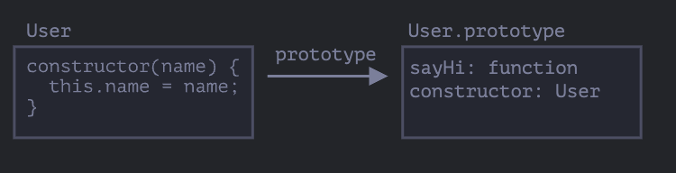
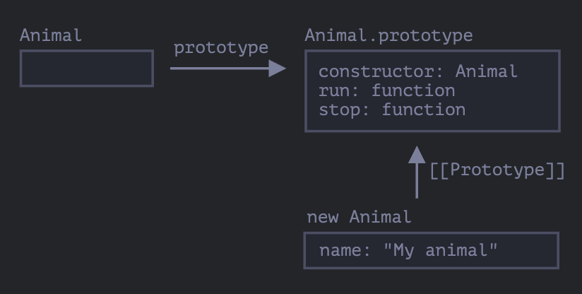
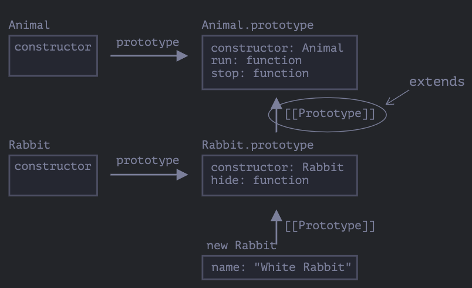
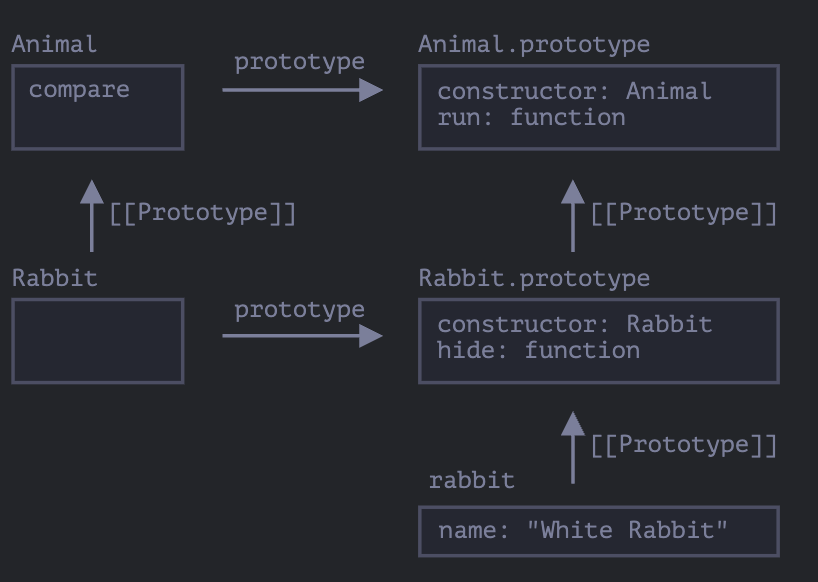
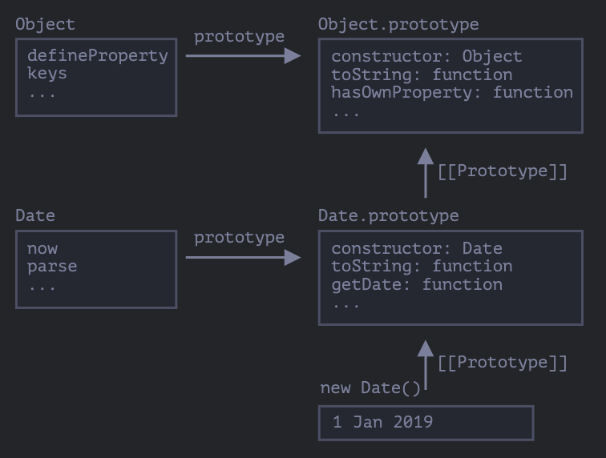
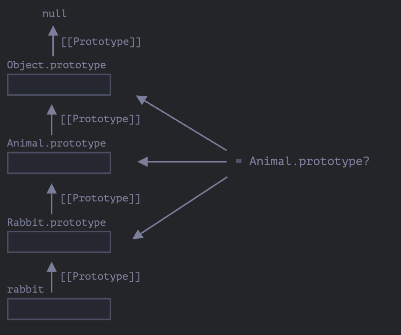

# 类

## “class”语法

基本语法：

```js
class MyClass {
  constructor() {}
  method1() {}
  method2() {}
}

let myclass = new MyClass();
```

在`new`的时候会自动调用`constructor`方法，因此可以在`constructor()`中初始化对戏那个。

```js
class User {
  constructor(name, age) {
    this.name = name;
    this.age = age;
  }
  sayHi() {
    console.log(`hi, my name is ${this.name}`);
  }
}

let user = new User("jack", 20);
user.sayHi();
```

当`new User('John')`被调用时：

1. 一个新对象被创建
2. `constructor`使用给定的参数运行，并将其赋值给`this.name`。

#### 什么是 class

```js
class User {
  constructor(name) {
    this.name = name;
  }

  sayHi() {
    console.log(this.name);
  }
}
let user = new User("jack");

console.log(typeof User); //function
```

`class User{...}`构造实际上做了如下的事：

1. 创建一个名为`User`的函数，该函数称为类声明的结果。该函数的代码来自于`constructor`方法（如果不编写它，那么它就被假定为空）。
2. 存储类中的方法，例如`User.prototype`中的`sayHi`。

我们把`class User`声明的结果解释为：



下面的代码可以很好的解释它们：

```js
class User {
  constructor(name) {
    this.name = name;
  }
  sayHi() {
    console.log(this.name);
  }
}
console.log(typeof User); //function

console.log(User === User.prototype.constructor); //true

console.log(User.prototype.sayHi); //sayHi方法中的代码

console.log(Object.getOwnPropertyNames(User.prototype)); //['constructor', 'sayHi']
```

#### 不仅仅是语法糖

人们常说`class`是一个语法糖（旨在使内容更易阅读，但不引入任何新内容的语法），因为我们实际上可以在不使用`class`的情况下声明相同的内容。

```js
//用纯函数重写class User
// 1. 创建构造器函数
function User(name) {
  this.name = name;
}

// 函数原型（prototype）默认具有'contstructor'属性
// 所以，我们不需要创建它

// 2. 将方法添加到原型中
User.prototype.sayHi = function () {
  console.log(this.name);
};

let user = new User("jack");
user.sayHi();
```

虽然这样定义的结果与使用类得到的结果基本相同。但是它们之间存在着重大差异：

1. 通过`class`创建的函数具有特殊的内部属性标记 `[[IsClassConstructor]]:true`,因此它们与手动创建并不完全相同

```js
class User {
  constructor() {}
}
alert(typeof User); //function

User(); //Uncaught TypeError: Class constructor User cannot be invoked without 'new'
```

此外大多数浏览器表示形式都是以'class'开头

```js
class User {
  constructor() {}
}

alert(User); // class User { ... }
```

2. 类方法不可枚举。类定义将`"prototype"`中的所有的方法设置为`{enumerable: false}`
3. 类总是使用`use strict`。在类构造中的所有代码都将自动进入严格模式。

#### 类表达式

```js
let User = class {
  sayHi() {
    console.log("hi");
  }
};
```

类似于命名函数表达式，类表达式可能也应该有一个名字。
如果类表达式有名字，那么该名字仅在类内部可见：

```js
// “命名类表达式（Named Class Expression）”
// (规范中没有这样的术语，但是它和命名函数表达式类似)
let User = class MyClass {
  sayHi() {
    console.log(MyClass);
  }
};
new User().sayHi();
/*
class MyClass{
  sayHi(){
    console.log(MyClass);
  }
}

*/

console.log(MyClass); //Uncaught ReferenceError: MyClass is not defined
```

动态按需创建类

```js
function makeClass(phrase) {
  return class {
    sayHi() {
      console.log(phrase);
    }
  };
}

let User = makeClass("hi");
new User().sayHi(); //hi
```

#### Getters/setters

```js
class User {
  constructor(name) {
    // 调用 setter
    this.name = name;
  }

  get name() {
    return this._name;
  }

  set name(value) {
    if (value.length < 4) {
      alert("Name is too short.");
      return;
    }
    this._name = value;
  }
}

let user = new User("John");
alert(user.name); // John

user = new User(""); // Name is too short.
```

#### 计算属性名称[...]

```js
class User {
  ["say" + "Hi"]() {
    console.log("Hello");
  }
}

new User().sayHi(); //Hello
```

#### Class 字符

```js
class User {
  name = "John";
  sayHi() {
    console.log(`Hello, ${this.name}!`);
  }
}

new User().sayHi(); //Hello, John!
```

重点区别在于，它们会被挂在实例对象中，而非`User.prototype`中。

```js
class User {
  name = "John";
}

let user = new User();

console.log(user.name); //John
console.log(User.prototype.name); //undefined
```

```js
class User {
  name = prompt("Name,please?", "John");
}

let user = new User();

console.log(user.name); //John
```

##### 使用类字段制作绑定方法

前面有过一个问题，当一个对象方法被传递到某处，或者在另一个上下文中被调用，则 this 将不再是对其对象的引用。

```js
class Button {
  constructor(value) {
    this.value = value;
  }

  click() {
    console.log(this.value);
  }
}

let button = new Button("hello");

setTimeout(button.click, 1000); //undefined
```

修复方式：

- 传递一个包装函数，例如`setTimeout(()=>button.click(),1000)`

- 将方法绑定到对象，例如在 constructor 中。

现在还有另一种办法

```js
class Button {
  constructor(value) {
    this.value = value;
  }

  click = () => {
    console.log(this.value);
  };
}

let button = new Button("hello");
setTimeout(button.click, 1000); //hello
```

#### 总结：

基本语法：

```js
class MyClass{
  prop = value;//属性
  constructor(){//构造器

  }

  method(){} //方法
  get something(){}//getter
  set something(){}//setter

  [Symbol.iterator](){}//计算属性名称

}
```

技术上来讲，`MyClass`是一个函数，而 methods、getters 和 setters 都被写入了`MyClass.prototype`。

## 类继承

类继承是一个类扩展另一个类的方式。

#### extends 关键字

假设我们有 class `Animal`：

```js
class Animal {
  constructor(name) {
    this.speed = 0;
    this.name = name;
  }
  run(speed) {
    this.speed = speed;
    console.log(`${this.name} runs with speed ${this.speed}.`);
  }
  stop() {
    this.speed = 0;
    console.log(`${this.name} stands still.`);
  }
}

let animal = new Animal("My animal");
```

`animal`和 class`Animal`的图形化表示：


现在创建另一个类`rabbit`它基于 class`Animal`，可以访问 animal 的方法。

扩展另一个类的语法是：`class Child extends Parent`。

```js
class Rabbit extends Animal {
  hide() {
    console.log(`${this.name} hides!`);
  }
}
let rabbit = new Rabbit("White Rabbit");
rabbit.run(5); //White Rabbit runs with speed 5.
rabbit.hide(); //White Rabbit hides!
```

class `Rabbit`的对象可以访问例如`rabbit.hide()`等`Rabbit`的方法，还可以访问例如`rabbit.run()`等`Animal`的方法。

在内部，关键字`extends`使用了酒的原型机制进行工作。它将`Rabbit.prototype.[[Protorype]]`设置位`Animal.prototype`。所以，如果在`Rabbit.prototype`上找不到一个方法，js 就会从`Animal.prototype`中获取该方法。



例如，要查找`rabbit.run`方法，JavaScript 引擎会进行如下检查（如图从下而上）。

1. 查找对象`rabbit`（没有 run）
2. 查找他的原型，即`Rabbit.prototype`（有 hide，但没有 run）
3. 查找他的原型，即(由于`extends`) `Animal.prototype`，在这找到了`run`方法。

::: tip 在`extends`后允许任意表达式
类语法不仅允许指定一个类，在`extends`后可以指定任意表达式。

例如，一个生成父类的函数调用：

```js
function f(phrase){
  return calss{
    sayHi(){
      console.log(phrase);
    }
  }
}

class User extends f('Hello'){}

new User().sayHi();//Hello
```

:::

#### 重写方法

子类中可以有自己的方法，例如`stop()`。通常情况下，我们不会完全覆盖父类的方法，一般是在父类方法的基础上进行扩展。这时候就需要用到`super`关键字。

- 执行`super.method()`来调用一个父类方法。
- 执行`super()`来调用一个父类 constructor(只能在我们的 constructor 中)

例如：

```js
class Animal {
  constructor(name) {
    this.speed = 0;
    this.name = name;
  }

  run(speed) {
    this.speed = speed;
    console.log(`${this.name} runs with speed ${this.speed}.`);
  }

  stop() {
    this.speed = 0;
    console.log(`${this.name} stands still.`);
  }
}

class Rabbit extends Animal {
  hide() {
    console.log(`${this.name} hides!`);
  }

  stop() {
    super.stop(); //调用父类的stop
    this.hide(); //执行自己的hide
  }
}

let rabbit = new Rabbit("White Rabbit");

rabbit.run(5); //White Rabbit runs with speed 5.
rabbit.stop(); //White Rabbit stands still. White Rabbit hides!
```

::: tip 箭头函数没有`super`

如果被访问，它会从外部函数获取，例如：

```js
class Rabbit extends Animal {
  stop() {
    setTimeout(() => super.stop(), 1000);
  }
}
```

箭头函数中的`super`与`stop()`中的是一样的，所以他能按照预期工作。如果我们在这里指定一个普通函数，那么将会抛出错误：

```js
setTimeout(function () {
  super.stop(); //错误
}, 1000);
```

:::

#### 重写 constructor

如果子类没有`constructor`,那么会自动调用父类的`constructor`。如下：

```js
class Rabbit extends Animal{

  constructor(...args){
    super(...args);
  }
}
```

当我们重建自己的`constructor`,

```js
class Animal {
  constructor(name) {
    this.speed = 0;
    this.name = name;
  }
  // ...
}

class Rabbit extends Animal {

  constructor(name, earLength) {
    this.speed = 0;
    this.name = name;
    this.earLength = earLength;
  }

  // ...
}

// 不工作！
let rabbit = new Rabbit("White Rabbit", 10); // Error: this is not defined.
```

继承类的constructor必须调用`super(...)`，并且一定要在使用`this`之前调用。

为什么？

因为在JavaScriot中，继承类（所谓的‘派生构造器’，英文名‘derived constructor’）的构造函数与其他函数之间是有区别的。派生构造器具有特殊的内部属性`[[ConstructorKind]]:"dericed"`。这是一个特殊的内部标签。

该标签会影响它的`new`行为。

- 当通过`new`执行一个常规函数时，它将创建一个空对象，并将这个空对象赋值给`this`。
- 但是当继承的constructor执行时，他不会执行此操作。它期望父类的constructor来做这件事。

因此派生的constructor必须调用`super`才能执行其父类（base）的constructor，否则`this`指向的那个对象将不会被创建。并且会收到一个报错。

```js
class Animal{
  constructor(name){
    this.speed = 0;
    this.name = name;
  }
}

class Rabbit extends Animal{
  constructor(name, earLength){
    super(name);
    this.earLength = earLength;
  }
}

// 现在可以了
let rabbit = new Rabbit("White Rabbit", 10);
console.log(rabbit.name); // White Rabbit
console.log(rabbit.earLength); // 10
```

#### 重写字段

```js
class Animal {
  name = 'animal';

  constructor() {
    alert(this.name); // (*)
  }
}

class Rabbit extends Animal {
  name = 'rabbit';
}

new Animal(); // animal
new Rabbit(); // animal
```

原因：

因为在js中类字段的初始化是这样的：

- 对于基类（还未继承任何东西的那种），在构造函数调用前初始化。
- 对于派生类，在`super`后立刻初始化。

在上面的代码中，由于Rabbit没有自己的`constructor`，所以它执行了父类的构造器，并且（根据派生类规则）只有在此之后，它的类字段才被初始化。在父类构造器被执行的时候，`Rabbit`还没有自己的类字段，这也是为什么`Animal`类字段被使用的原因。

#### 深入探究和[[HomeObject]]

[第一次看好麻烦](https://zh.javascript.info/class-inheritance#shen-ru-nei-bu-tan-jiu-he-homeobject)


## 静态属性和静态方法

在一个类中为整个类分配一个方法。这样的方法被称为 **静态的（static）**

```js
class User{
  static staticMethod(){
    console.log(this === User);
  }
}

User.staticMethod();//true
```

它和直接将其作为属性赋值的作用相同：

```js
class User{

}

User.staticMethod = function(){
  console.log(this === User);
}

User.staticMethod();//true
```

通常来说，静态方法用于实现属于整个类，但不属于该类任何特定对象的函数。

例如，我们有对象`Article`，并且需要一个方法来比较他们。

```js
class Article{
  constructor(title,date){
    this.title = title;
    this.date = date;
  }

  static compare(articleA,articleB){
    return articleA.date - articleB.date;
  }
}

let articles = [
  new Article("HTML", new Date(2019, 1, 1)),
  new Article("CSS", new Date(2019, 0, 1)),
  new Article("JavaScript", new Date(2019, 11, 1))
]
articles.sort(Article.compare);
console.log(articles[0].title); // CSS
```

另一个例子：所谓的‘工厂’方法。

```js
class Article{
  constructor(title,date){
    this.title = title;
    this.date = date;
  }

  static createTodays(){
    return new this("Today's digest", new Date());
  }
}

let article = Article.createTodays();
console.log(article.title); // Today's digest
```

现在，每当我们需要创建一个今天的文章时，我们就可以调用`Article.createTodays()`。它是整个class的方法。

::: warning 静态方法不适用于单个对象
静态方法可以在类上调用，而不是在单个对象上。例如

```js
article.createTodays(); /// Error: article.createTodays is not a function
```
:::

#### 静态属性

```js
class Article{
  static publisher = 'Ilya Kantor';
}

console.log(Article.publisher); // Ilya Kantor
```

等同于

```js
Article.publisher = 'Ilya Kantor';
```

#### 继承静态属性和方法

静态属性和方法是可被继承的。

```js
class Animal{
  static planet = 'Earth';
  constructor(name,speed){
    this.speed = speed;
    this.name = name;
  }

  run(speed = 0){
    this.speed += speed;
    console.log(`${this.name}runs with speed ${this.speed}.`)
  }

  static compare(animalA,animalB){
    return animalA.speed - animalB.speed;
  }
}

class Rabbit extends Animal{
  hide(){
    console.log(`${this.name} hides!`)
  }
}

let rabbits = [
  new Rabbit("White Rabbit", 10),
  new Rabbit("Black Rabbit", 5)
]

rabbits.sort(Rabbit.compare);

rabbits[0].run();//Black Rabbit runs with speed 5.
console.log(Rabbit.planet);//Earth
```

现在调用`Rabbit.compare`时，继承`Animal.compare`将会被调用。

工作原理如下：



所以,`Rabbit extends Animal`创建了两个`[[Prototype]]`引用：

1. `Rabbit`函数原型继承自`Animal`函数。
2. `Rabbit.prototype`原型继承自`Animal.prototype`。

结果就是继承对常规方法和静态方法都有效。

```js
class Animal {}
class Rabbit extends Animal {}

// 对于静态的
alert(Rabbit.__proto__ === Animal); // true

// 对于常规方法
alert(Rabbit.prototype.__proto__ === Animal.prototype); // true
```

#### 总结：
- 静态方法被用于实现属于整个类的功能。他和具体的类实例无关。
- 静态属性和方法是可被继承的。


## 私有的和受保护的属性和方法

#### 受保护的

用 `_name`的形式命名，是一个公知的约定。但是具体就是一个正常的属性。

```js
class CoffeeMachine {
  _waterAmount = 0;

  set waterAmount(value) {
    if (value < 0) {
      value = 0;
    }
    this._waterAmount = value;
  }

  get waterAmount() {
    return this._waterAmount;
  }

  constructor(power) {
    this._power = power;
  }

}

// 创建咖啡机
let coffeeMachine = new CoffeeMachine(100);

// 加水
coffeeMachine.waterAmount = -10; // _waterAmount 将变为 0，而不是 -10
```

#### 私有的

用`#name`的形式命名，是javascript新出的特性。

```js
class CoffeeMachine{
  #waterLimit = 200;

  #fixWaterAmout(value){
    if(value<0)return 0
    if(value>this.#waterLimit) return this.#waterLimit
  }

  setWaterAmout(value){
    this.#waterLimit = this.#fixWaterAmout(value);
  }
}

let coffeeMachine = new CoffeeMachine();
// 不能从类的外部访问类的私有属性和方法
coffeeMachine.#fixWaterAmount(123); // Error
coffeeMachine.#waterLimit = 1000; // Error
```

特点：

- 无法从外部或从继承的类中访问它。
- 并且无法被继承
- 不能通过this[name]访问

不过我们可以通过定义一个get/set来访问或修改它。

```js
class CoffeeMachine{
  #waterAmount = 0;

  get waterAmount(){
    return this.#waterAmount;
  }

  set waterAmount(value){
    if(value<0) value = 0;
    this.#waterAmount = value;
  }
}

let machine = new CoffeeMachine();
machine.waterAmount = 10;
console.log(machine.waterAmount); // 10
console.log(machine.#waterAmount); // Error\

class MegaCoffeeMachine extends CoffeeMachine {
  method() {
    alert( this.#waterAmount ); // Error: can only access from CoffeeMachine
  }
}
```


## 扩展内建类

内建的类，例如`Array`,`Map`等也都是可以扩展的。

例如：

```js
class PowerArray extends Array{
  isEmpty(){
    return this.length === 0;
  }
}

let arr = new PowerArray(1,2,3,4,5);
console.log(arr.isEmpty()); // false

let filtered = arr.filter(item => item >= 3);
console.log(filtered); // [3,4,5]
console.log(filtered.isEmpty()); // false
```

在上面的例子中：

```js
arr.constructor === PowerArray;
```

当`arr.filter()`被调用时，它的内部使用的是`arr.constructor`来创建新的结果数组，而不是使用原生的`Array`。

我们也可以为类添加一个特殊的静态属性getter`Symbol.species`，它会返回JavaScript在内部用来在`map`和`filter`等方法中创建新实体的`constructor`。

```js
class PowerArray extends Array{
  isEmpty(){
    return this.length ===0;
  }
  static get [Symbol.species](){
    return Array;
  }
}

let arr = new PowerArray(1,2,3,4,5);
console.log(arr.isEmpty()); // false

let filtered = arr.filter(item => item >= 3);
console.log(filtered.isEmpty());//Uncaught TypeError: filtered.isEmpty is not a function 
```

现在`.filter`返回`Array`。所以扩展的功能不在传递。

::: tip 其他集合的工作方式类似
其他集合，例如 `Map` 和 `Set` 的工作方式类似。它们也使用 `Symbol.species`。
:::

#### 内建类没有静态方法继承



正常来说，当一个类扩展另一个类时，静态方法和非静态方法都会被继承。但是内建类是一个例外，它们相互间不继承静态方法。

例如，`Array`和`Date`都继承自`Object`，所以它们的实例都来自`Object.prototype`的方法。但`Array.[[Prototype]]`并不指向`Object`,所以它们没有例如`Array.keys`这些静态方法。

## 类检查：'instanceof'


`instanceof`操作符用于检查一个对象是否属于某个特定的class。同时，它还考虑了继承。

#### instanceof 操作符

语法：
```js
obj instanceof Class 
```

如果`obj`隶属于`Class`类（或`Class`类的衍生类），则返回`true`。

例如：

```js
class Rabbit{

}

let rabbit = new Rabbit();

console.log(rabbit instanceof Rabbit); // true
```

和构造函数一起使用：

```js
function Rabbit(){}

console.log(new Rabbit() instanceof Rabbit);//true
```

和内建class一起使用

```js
let arr = [1,2,3];

console.log(arr instanceof Array);//true
console.log(arr instanceof Object);//true
```

`instanceof`的算法如下：

1. 检查对象中有没有`Symbol.hasInstance`，那就直接调用这个方法。

```js
class Animal{
  static  [Symbol.hsaInstance](obj){
    if(obj.canEat)return true;
  }
}

let obj = {canEat:true};
console.log(obj instanceof Animal);//true
```

2. 如果没有`Symbol.hasInstance`，那么`instanceof`会检查`obj.__proto__`是否指向`Class.prototype`。

```js
obj.__proto__ === Class.prototype?
obj.__proto__.__proto__ === Class.prototype?
obj.__proto__.__proto__.__proto__ === Class.prototype?
...
// 如果任意一个的答案为 true，则返回 true
// 否则，如果我们已经检查到了原型链的尾端，则返回 false
```

如下：

```js
class Animal {}
class Rabbit extends Animal {}

let rabbit = new Rabbit();
alert(rabbit instanceof Animal); // true

// rabbit.__proto__ === Animal.prototype（无匹配）
// rabbit.__proto__.__proto__ === Animal.prototype（匹配！）
```



还有一个方法：`objA.isPrototypeOf(objB)`,如果`objA`处在`objB`的原型链上，则返回`true`。所以，可以将`instanceof`替换为`Class.prototype.isPrototypeOf(obj)`。
但是`Class`的constructor自身是不参与检查的，检查过程只和原型链以及`Class.prototype`有关。

#### 使用Object.prototype.toString方法来揭示类型

```js
let obj = {};
console.log(obj);//[object,Object]
console.log(obj.toString());
```

Object.prototype.toString.call 返回值：

- 对于number，结果是`[object Number]`
- 对于boolean，结果是`[object Boolean]`
- 对于undefined，结果是`[object Undefined]`
- 对于null，结果是`[object Null]`
- 对于数组，结果是`[object Array]`
- 对于函数，结果是`[object Function]`
- 对于Date，结果是`[object Date]`


##### Symbol.toStringTag

使用`Symbol.tostringTag`自定义对象的`toString`方法的行为。

```js
let user = {
  [Symbol.toStringTag]: "User"
}
console.log({}.toString.call(user));//[object,User]
```