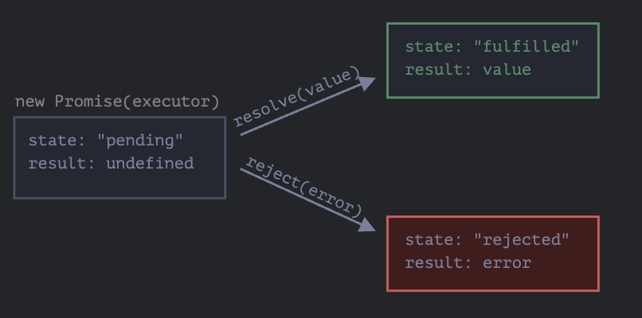

# Promise

## Promise是什么

语法格式：

```js
let promise = new Promise(function(resolve,reject){
//业务代码
})
```

- resolve(value) 任务成功完成并带有结果value
- reject(error) 出现error，error即为error对象。


内部属性：

- state --最初是“pending”,然后在`resolve`被调用时变为`fulfilled`,或者在`reject`被调用时变为`rejected`

最终效果如下：



### resolve、reject

```js
let promise = new Promise(function(resolve,reject){
  setTimeout(()=>resolve('done'),1000)
})
```

执行过程：
1. executor被自动且立即调用（通过new Promise）
2. executor接受两个参数：resolve和reject。这些函数由JavaScript引擎预先定义，因此我们不需要创建它们。经过一秒的处理后，executor调用resolve('done')，这会改变promise的状态为fulfilled，并设置其结果为'done'。

```js
let promise = new Promise(function(resolve,reject){
  setTimeout(()=>reject(new Error('Whoops')),1000)
})
```

对reject()的调用将promise对象的状态移至‘rejected’

::: tip 只有一个结果或一个error

executor 只能调用一个resolve或一个reject。任何状态的更改都是最终的。
所有其他的在对resolve和reject的调用都会被忽略。

```js
let promise = new Promise(function(resolve,reject){
  resolve('done');
  reject(new Error('...'));//被忽略
  setTimeout(()=>resolve('...'),1000);//被忽略
})
```
关键在于，一个由executor完成的工作职能由一个结果或一个error

并且，resolve/reject只需要一个参数（或不包含任何参数），并且将忽略额外的参数。
:::

::: tip resolve/reject可以立即进行

实际上，executor通常是一部执行某些操作，并在一段时间后调用`resolve/reject`，但这不是必须的。我们还可以立即调用`resolve`或`reject`

```js
let promise = new Promise(function(resolve,reject){
  resolve('123')
})
```
:::

### then、catch

#### then

语法：
```js
promise.then(
  function(result){},
  function(error){}
)
```

.then的第一个参数是一个函数，该函数将在promise resolveed切接受到结果后执行。
.then的第二个参数也是一个函数，该函数将在promise rejected且接收到error信息后执行。

```js
let promise = new Promise(function(resolve,reject){
  setTimeout(()=>resolve('done'),1000)
})

promise.then(result=>alert(result),//一秒后执行

error=>alert(error));//不运行
```

#### catch

如果只对error感兴趣，那么我们可以使用`null`作为第一个参数：`.then(null,errorHandlingFunction)`。或者可以使用`.catch(errorHandlingFunction)`，它等同于`.then(null,errorHandlingFunction)`。

### finally

无论promise是resolved还是rejected，finally的回调函数都会执行。

```js
let promise = new Promise((resolve,reject)=>{
    setTimeout(()=>{resolve(1000)},1000)
}).then(res=>{
   return res
}).finally(()=>{
    console.log('finally');
}).then(res=>{
    console.log(res,'res')
})
```

总结：
- finally 处理程序没有得到前一个处理程序的结果（它没有参数）。而这个结果被传递给了下一个合适的处理程序。
- 如果finally处理程序返回了一些内容，那么这些内容会被忽略
- 当finally 抛出error是，执行将转到最近的error的处理程序。

## Promise链

```js
new Promise(function(resolve,reject){
  setTimeout(()=>resolve(1),1000)
}).then(res=>{
  alert(res);//1
  return res * 2
}).then((res)=>{
  alert(res)//2
  return res * 2
}).then(res=>{
  alert(res);//4
  return res * 2
})
```

执行流程

通过`.then`处理程序（handler）链进行传递result。

运行流程如下：

1. 初始promise在1秒后resolve
2. 然后`.then`处理程序被调用，它又创建了一个新的promise（以2作为值resolve）
3. 下一个`then`得到前一个`then`的值，对该值进行处理，并将其传递给下一个处理程序
4. 依次类推

这样之所以可行，是因为每个对`then`的调用都返回了一个新的promise。


::: tip Thenables
确切的说，处理程序返回的不完全是一个 promise，而是返回的被称为"thenables"的对象 --- 一个具有方法`.then`的任意对象。它会被当作一个promise来对待。

```js
class Thenable{
  constructor(num){
    this.num = num;
  }

  then(resolve,reject){
    console.log(resolve);
    setTimeout(()=>resolve(this.num*2),1000)
  }
}

new Promise(resolve =>resolve(1)).then(res=>{
  return new Thenable(res)
}).then(res=>{
  console.log(res);
})
```
:::

### 总结
如果`.then`（或`catch/finally`都可以）处理程序返回一个promise，那么链的其余部分都将会等待，直到它状态变为settled。当它被settled后，其result（或error）将被进一步传递下去。

### 任务

Promise：then对比catch，这两个代码是否相等，
```js
promise.then(f1).catch(f2);
// 对比
promise.then(f1, f2);

/**
 * 不相等
 * 不同之处在于，如果f1中出现error，那么他会被f2处理
 * 但是promise.then(f1, f2);不会
 * 
 */
```

## 使用promise进行错误处理

.catch()会处理最近的错误。

### 隐式try...catch

promise 的执行者和promise的处理程序周围有一个隐式的try...catch。如果发生异常，它就会被捕获，并被思维rejection进行处理。

例如：下面这段代码

```js
new Promise(function(resolve,reject){
  throw new Error('Whoops');
}).catch(alert);//Error: Whoops
```
和下面的代码工作上完全相同

```js
new Promise(function(resolve,reject){
  reject(new Error('Whoops'))
}).catch(alert);//Error: Whoops
```

### 再次抛出

```js
new Promise((resolve,reject)=>{
  throw new Error('Whoops')
}).catch(error=>{
  // if(error instanceof URLError){
  //   //处理它
  // }else{
    alert("Can't handle such error");
    throw error;//再次抛出
  // }
}).then(()=>{}).catch(error=>{
  alert(`The unknown error has occurred: ${error}`);
})
```

### 未处理的rejection

如果promise被reject，并且没有处理程序来处理它，那么浏览器会记录一个错误。

```js
window.addEventListener('unhandledrejection', function(event) {
  // 这个事件对象有两个特殊的属性：
  alert(event.promise); // [object Promise] —— 生成该全局 error 的 promise
  alert(event.reason); // Error: Whoops! —— 未处理的 error 对象
});

new Promise(function() {
  throw new Error("Whoops!");
}); // 没有用来处理 error 的 catch
```

### 总结：

- `.catch`处理promise中的各种error：在`reject()`调用中的，或者在处理程序中抛出的error
- 如果给定`.then`的第二个参数（既error处理程序），那么`.then`会以相同的方式捕获error
- 如果没有处理程序，那么error会通过`window.onunhandledrejection`事件传播出去
- 如果error被处理了，那么程序不会崩溃，会继续执行

### 任务

```js
new Promise(function(resolve,reject){
  setTimeout(()=>{
    throw new Error('Whoops')
  },1000)
}).catch(alert);

```
上面的代码会报错吗？

不会，因为promise的执行者和promise的处理程序周围有一个隐式的try...catch。它是处理同步错误的，这里的错误不是在运行时生成的，而是在稍后生成的。因此promise无法处理它。

```js
new Promise(function(resolve, reject) {
  setTimeout(() => {
    reject(new Error("Whoops!"));
  }, 1000);
}).catch(alert);
```
这样就可以了